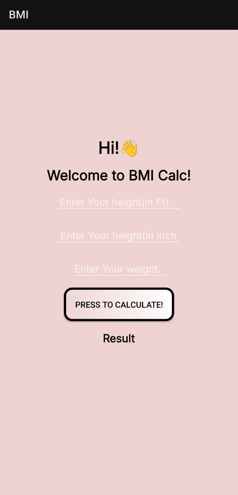
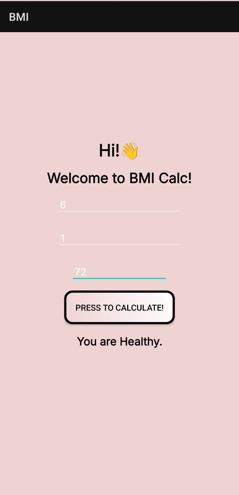

# BMI Calculator

A simple and user-friendly **Android app** that calculates **Body Mass Index (BMI)** and provides a health assessment. This project serves as a showcase of fundamental Android development concepts using Java and XML.

<br>

## ✨ Features
* **Input Flexibility:** Allows users to input height in a user-friendly format of **feet and inches**.
* **Metric System:** Calculates BMI based on weight entered in **kilograms**.
* **Health Assessment:** Provides a clear health status (`Underweight`, `Healthy`, or `Overweight`) based on the calculated BMI.
* **User-friendly Interface:** Designed with a clean, intuitive layout for a seamless user experience.
* **Offline Functionality:** Works completely offline, with no internet connection required.

<br>

## 📸 Screenshots

| Main Screen | Result Screen |
| :---: | :---: |
|  |  |

<br>

## 🚀 Technologies Used
* **Java** – The primary programming language for the app's logic.
* **Android Studio** – The official IDE for Android development.
* **XML** – Used for designing the user interface and app layouts.
* **Android SDK** – The Software Development Kit providing the necessary tools and APIs.

<br>

## 🛠️ Installation
To get a local copy up and running, follow these simple steps.

1.  Clone the repository:
    ```bash
    git clone [https://github.com/Kavychaturvedi5427/BMI-Calc.git](https://github.com/Kavychaturvedi5427/BMI-Calc.git)
    ```

2.  Open the project in **Android Studio**.

3.  Build and run the app on an Android emulator or a physical device.

<br>

## 📂 Project Structure
BMICalc/
├── app/
│   ├── src/
│   │   ├── main/
│   │   │   ├── java/
│   │   │   │   └── com/
│   │   │   │       └── example/
│   │   │   │           └── bmicalc/  # Java source code
│   │   │   │               ├── MainActivity.java
│   │   │   │               └── ResultActivity.java
│   │   │   ├── res/
│   │   │   │   ├── drawable/       # Icons and images
│   │   │   │   ├── layout/         # XML layout files
│   │   │   │   │   ├── activity_main.xml
│   │   │   │   │   └── activity_result.xml
│   │   │   │   └── values/         # Colors, strings, styles, etc.
│   │   │   │       ├── colors.xml
│   │   │   │       ├── strings.xml
│   │   │   │       └── themes.xml
│   │   └── ... (other build files)
│   └── build/                      # Auto-generated build files
├── .gitignore                      # Specifies untracked files to be ignored
└── README.md                       # This file
